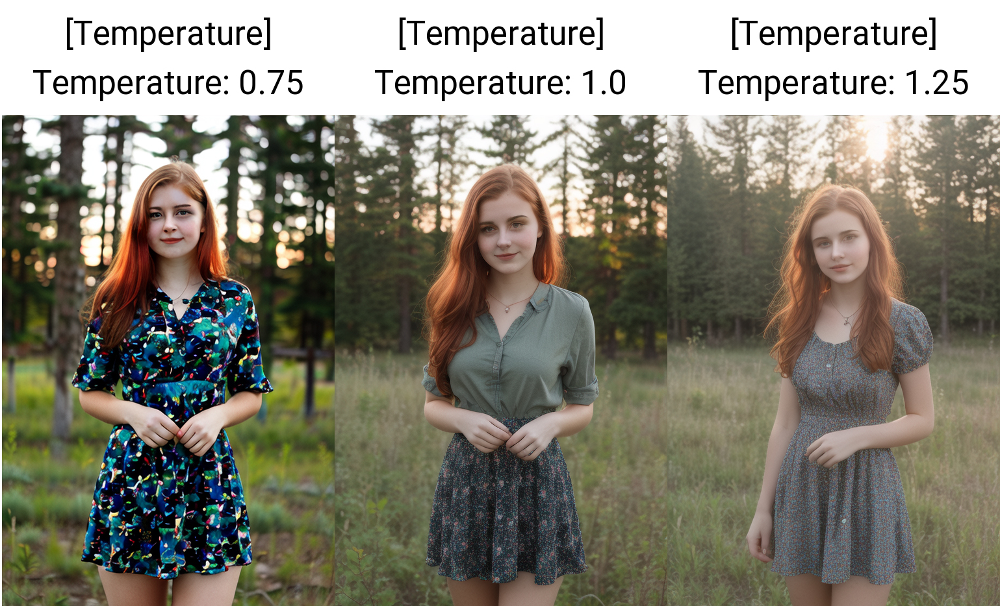

# A1111 SD WebUI Temperature Settings **WIP**
This is an Extension for the [A1111 SD WebUI](https://github.com/AUTOMATIC1111/stable-diffusion-webui), which implements "UNET temperature settings."

And CLIP in the future

 
<code>outdoors, girl, red hair, sunset, natural lighting, (bokeh:1.3), Porta 160 color, full body shot</code> 
<b>Checkpoint:</b> nextphoto v3.0 zer0int CLIP

P.S. At the moment switching attention does not work, this is the earliest version of a such extension for the A1111 WebUI

But I'm working on it :)

- Credits to the original author, **[Extraltodeus](https://github.com/Extraltodeus)**, and **[Haoming02](https://github.com/Haoming02)** who ported the original nodes to Forge
